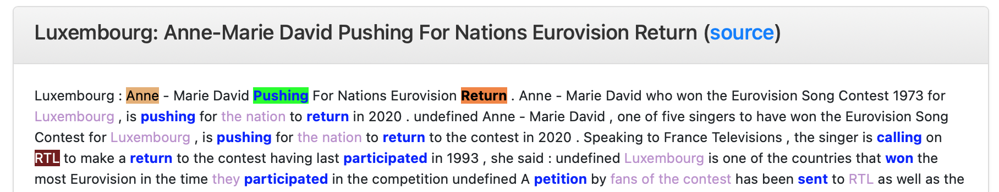

# Shared Dataset

We provide a multuilingual and referentially grounded dataset consisting of texts about the Eurovision Song Contest (spanning the years 2019, 2020, and 2021). The dataset has been collected via Wikidata and Wikipedia in such a way that each document is referenitally grounded to an event (a specific edition of Eurovision) or a particular participant (an artist participating in an event of Eurovision). A subset of documents have been manually annotated with Frame Semantic information and coreference. Another subset has been labeled automatically for coreference resolution.

You can access the data via our [Github repository](https://github.com/cltl/rfp_corpus_collection)

We are still working on processing the data and will update the repository regularly.

Participants are welcome to use the data in any way they like. For instance, participants could

* use part of the data to show a new annotation approach for Frame Semantics and perspectives.
* use examples from the data for linguistic analysis
* correct our automatic annotations (turn automatic lables into gold data)
* run a frame or perspective identification tool and analyze the results

## Frame Semantic annotations in the data

Our manual, Frame Semantic annotations follow an annotation approach developed in the Open Dutch FrameNet project. The goal is to annotate Dutch texts with Frame Semantic information following the FrameNet paradigm. In contrast to tradition FrameNet annotations, our approach allows for a discourse-level view, rather than remaining limited to sentence boundaries; we annotate semantic roles of predicates, even if they are not mentioned in the same sentence as the predicate (for more details, refer to Remijnse et al. 2022).

<!-- An example is shown below:

 -->

### References:

Remijnse, L., Vossen, P., Fokkens, A. and Titarsolej, S., 2022, June. Introducing Frege to Fillmore: A FrameNet Dataset that Captures both Sense and Reference. In Proceedings of the Thirteenth Language Resources and Evaluation Conference (pp. 39-50).

[Back to the Call for Papers](https://cltl.github.io/reference-framing-perspective)
